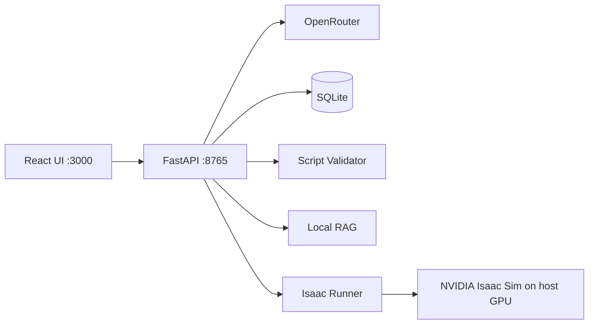

# Synthera World

**Configure. Generate. Simulate.**

Synthera World is a full-stack workspace for building NVIDIA Isaac Sim simulations without hand-writing boilerplate. Pick a humanoid or AMR robot, describe the task in natural language, get a validated Python script from an LLM, and run it locally with live log streaming.

> **Status:** Beta v0. Isaac Sim runs on the host GPU. The backend can run natively or in Docker.

## Highlights

- Visual configurator (React + Zustand): robot, scene, sensors, task, duration
- AI script generation (FastAPI + OpenRouter): Claude, Sonnet, Nemotron
- 5-layer script validation before GPU runs
- Async Isaac Sim runner with SSE log streaming
- SQLite history under `~/.synthera-world/`
- Local RAG over project docs for humanoid generation and chat

## Supported robots (Beta v0)

| Category | Asset | USD path |
|----------|-------|----------|
| Humanoid | Unitree H1 | `/Isaac/Robots/Unitree/H1/h1.usd` |
| AMR | Clearpath Ridgeback | `/Isaac/Robots/Clearpath/Ridgeback/ridgeback.usd` |
| AMR | Clearpath Jackal | `/Isaac/Robots/Clearpath/Jackal/jackal.usd` |
| AMR | NVIDIA Carter v1 | `/Isaac/Robots/Carter/carter_v1.usd` |

## Architecture



## Tech stack

| Layer | Stack |
|-------|--------|
| Frontend | React 18, Vite, TailwindCSS, Zustand |
| Backend | FastAPI, SQLModel, httpx, asyncio |
| AI | OpenRouter |
| Simulation | NVIDIA Isaac Sim 5.0+ (native on host) |
| Data | SQLite + `~/.synthera-world/simulations/` |

## Prerequisites

| Requirement | Notes |
|-------------|--------|
| OS | Linux (Ubuntu 22.04 recommended) |
| GPU | NVIDIA RTX with working drivers (`nvidia-smi`) |
| Isaac Sim | 5.0 or newer, installed and licensed on the host |
| Isaac assets | Robot USDs under an `Isaac/Robots/...` tree |
| Python 3.10 | For the Synthera backend (separate from Isaac `python.sh`) |
| Node.js 18+ | For the React UI |
| OpenRouter API key | Required for `/generate` |

Isaac Sim is **not** run inside Docker. Only the FastAPI backend can be containerized.

---

## Getting started (Isaac Sim 5.0)

### 1. Install Isaac Sim 5.0

Install Isaac Sim 5.0 using NVIDIA's official method (pip, launcher, or tarball). Confirm the install:

```bash
export ISAAC_SIM_PATH="$HOME/isaacsim"          # folder containing python.sh
export ISAAC_SIM_PYTHON="$ISAAC_SIM_PATH/python.sh"

"$ISAAC_SIM_PYTHON" --version
```

Robot USDs are often in a separate assets pack. The assets root must contain paths like `Isaac/Robots/Unitree/H1/h1.usd`:

**Path mapping:** Synthera resolves nucleus paths such as `/Isaac/Robots/Unitree/H1/h1.usd` to:

`$ISAAC_ASSETS_ROOT/Isaac/Robots/Unitree/H1/h1.usd`

| Variable | Points to |
|----------|-----------|
| `ISAAC_SIM_PATH` | Isaac install root (`python.sh`, kit, extensions) |
| `ISAAC_SIM_PYTHON` | `"$ISAAC_SIM_PATH/python.sh"` |
| `ISAAC_ASSETS_ROOT` | Folder containing `Isaac/Robots/...` (e.g. `.../Assets/Isaac/5.0`) |

### 2. Clone the repository

```bash
git clone https://github.com/<your-username>/synthera-world.git
cd synthera-world
```

### 3. Configure environment

```bash
cp env.example .env
```

Edit `.env` for your machine. Example for Isaac Sim 5.0:

```bash
OPENROUTER_API_KEY=sk-or-v1-your-key-here

ISAAC_SIM_PATH=/home/<you>/isaacsim
ISAAC_SIM_PYTHON=/home/<you>/isaacsim/python.sh
ISAAC_ASSETS_ROOT=/home/<you>/isaacsim_assets/Assets/Isaac/5.0

RAG_DOCS_DIR=/home/<you>/synthera-world/rag
SYNTHERA_DATA_DIR=/home/<you>/.synthera-world

AI_MODEL=anthropic/claude-haiku-4-5-20251001
RAG_FOR_GENERATE=true
RAG_GENERATE_TOP_K=6
```

Load variables for shell scripts:

```bash
set -a && source .env && set +a
```

### 4. Validate install and scan robots

From the repo root:

```bash
python3.10 scripts/validate_install.py
python3.10 scripts/scan_assets.py
```

### 5. Start the backend

```bash
bash scripts/setup.sh
source backend/venv/bin/activate
cd backend
uvicorn main:app --reload --host 0.0.0.0 --port 8765
```

In another terminal:

```bash
curl http://localhost:8765/health
curl http://localhost:8765/assets
```

### 6. Start the frontend

```bash
cd frontend
npm install
npm run dev
```

Open [http://localhost:3000](http://localhost:3000). Configure a simulation, click **Generate**, then **Run**.

### 7. API-only test (optional)

```bash
curl -X POST http://localhost:8765/generate \
  -H "Content-Type: application/json" \
  -d '{
    "robot": {
      "category": "amr",
      "asset_name": "Clearpath Jackal",
      "asset_path": "/Isaac/Robots/Clearpath/Jackal/jackal.usd"
    },
    "scene": { "environment": "warehouse", "lighting": "day", "obstacles": false },
    "task": { "description": "drive forward slowly", "duration_seconds": 20 },
    "sensors": { "camera": false, "imu": true, "lidar": false },
    "output": { "headless": true, "export_telemetry": false }
  }'
```

---

## Docker (backend only, optional)

```bash
docker compose up --build
```

Your `.env` must still set `ISAAC_SIM_PATH` and `ISAAC_SIM_PYTHON` to the host install. Isaac Sim always runs on the host via `ISAAC_SIM_PYTHON`.

---

## API

| Method | Endpoint | Description |
|--------|----------|-------------|
| `GET` | `/health` | API, Isaac path, model config |
| `POST` | `/generate` | SimConfig to validated Python script |
| `POST` | `/simulate` | Run script, stream logs (SSE) |
| `POST` | `/simulate/stop` | Stop active simulation |
| `GET` | `/assets` | Local humanoid and AMR catalog |
| `GET` | `/simulations` | Run history from SQLite |
| `POST` | `/chat` | Assistant with local RAG context |

---

## Script validation

Every generated script passes five checks before it is returned or executed:

1. Python syntax (`ast.parse`)
2. Forbidden patterns (`omni.isaac.*`, `subprocess`, etc.)
3. Allowed `isaacsim.*` API surface
4. USD paths from the asset catalog

---

## Project layout

```
synthera-world/
├── frontend/          # React configurator and log viewer
├── backend/           # FastAPI, AI client, validator, Isaac runner
├── isaac_templates/   # Reference Isaac Sim scripts
├── scripts/           # setup, validate_install, scan_assets
├── rag/               # Local docs for RAG retrieval
└── AGENTS.md          # Architecture and conventions
```

---

## Development without GPU

---

## Troubleshooting

| Problem | Fix |
|---------|-----|
| Empty `/assets` or catalog | Fix `ISAAC_ASSETS_ROOT`; re-run `python3.10 scripts/scan_assets.py` |
| `ISAAC_SIM_PYTHON is not configured` | Set `ISAAC_SIM_PYTHON` in `.env`; restart the backend |
| `ModuleNotFoundError: sqlmodel` | Activate `backend/venv` before running uvicorn |
| Validator rejects generated script | Check `backend/data/asset_catalog.json` |
| Generate works, Run fails | Test `isaac_templates/humanoid_stand.py` with `"$ISAAC_SIM_PYTHON"` |
| Conda warning from Isaac | Warning only; simulation may still run |

See also [`rag/troubleshooting.md`](rag/troubleshooting.md).

---

## Environment variables

See [`env.example`](env.example).

| Variable | Purpose |
|----------|---------|
| `OPENROUTER_API_KEY` | LLM API access |
| `AI_MODEL` | Primary model |
| `ISAAC_SIM_PATH` | Local Isaac Sim install |
| `ISAAC_SIM_PYTHON` | Path to Isaac `python.sh` |
| `ISAAC_ASSETS_ROOT` | On-disk root for `/Isaac/...` USD paths |
| `SYNTHERA_DATA_DIR` | SQLite DB and generated scripts |
| `RAG_FOR_GENERATE` | Append RAG chunks to generate prompt |
| `RAG_DOCS_DIR` | Path to `rag/` documentation |
